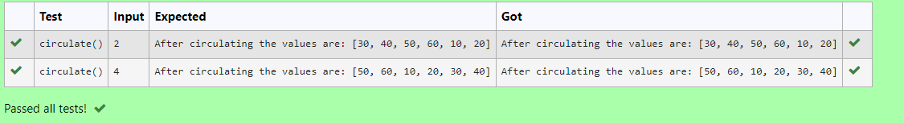

# Circulate-the-values-of-N-variables
## Aim:
To write a python program to circulate the n variables using function concept
## Equipment’s required:
PC
Anaconda - Python 3.7
## Algorithm: 
### Step 1: start
### Step 2: define a function
### Step 3: enter a list in variable i
Get the value from the user for the number of rotation
### Step 4: 
Using the slicing concept rotate the list

### Step 5: call the fuction
### Step 6: stop
## Program:
~~~ PYTHON
#Program to circulate N values.
#Developed by: Bairav Skandan Loha
#RegisterNumber:210001069

def circulate():
     n = int(input())
     i = [10,20,30,40,50,60]
     i = i[n:]+i[:n]
     print("After circulating the values are:",i)
     return
~~~
    
    

## Output:

## Result:
